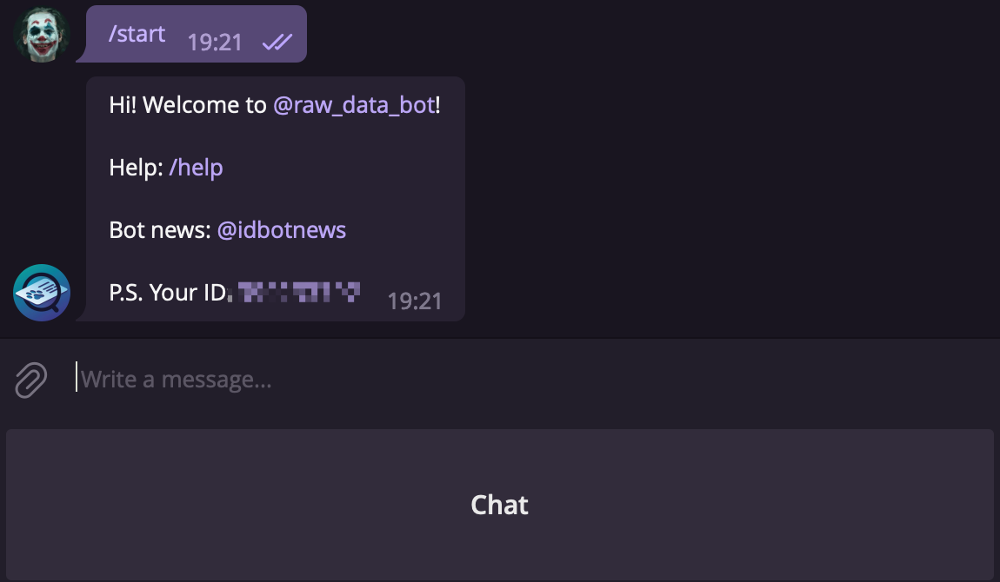

## Slothunter Webhook Feature

### Integration with Slack

To integrate the webhook feature with Slack, you'll first need to create a Slack App.

1. Navigate to [https://api.slack.com/apps](https://api.slack.com/apps) and click on the `Create New App` button.

   

2. In the pop-up window that appears, select `From scratch`.

   

3. Provide a name for your app and select the workspace where you'd like the app to post messages. Click `Create App`.

   

4. Click on `Incoming Webhooks` under the `Add features and functionality` section.

   

5. Toggle the switch to turn on Incoming Webhooks and click `Add New Webhook to Workspace`.

   

6. Select the channel where you'd like the app to post messages and click `Allow` to provide the necessary permissions. If the channel name doesn't appear automatically, you may need to type it manually.

   

7. Finally, copy the Webhook URL and paste it into the `[notification].webhooks` section of the Slothunter configuration file.

	


### Integration with Telegram

To integrate the webhook feature with Telegram, you'll initially need to create a Telegram Bot.

1. Open Telegram, search for `@bot`, and activate the Bot Father.

   

2. Interact with the Bot Father to create a new bot for yourself.

```
Xavier Lau
/newbot

BotFather
Alright, a new bot. How are we going to call it? Please choose a name for your bot.

Xavier Lau
Slothunter

BotFather
Good. Now let's choose a username for your bot. It must end in `bot`. Like this, for example: TetrisBot or tetris_bot.

Xavier Lau
slothunter123_bot

BotFather
Done! Congratulations on your new bot. You will find it at t.me/slothunter123_bot. You can now add a description, about section and profile picture for your bot, see /help for a list of commands. By the way, when you've finished creating your cool bot, ping our Bot Support if you want a better username for it. Just make sure the bot is fully operational before you do this.

Use this token to access the HTTP API:
xxx:xxx
Keep your token secure and store it safely, it can be used by anyone to control your bot.

For a description of the Bot API, see this page: https://core.telegram.org/bots/api
```

3. Visit [https://github.com/hack-ink/telegram-webhook](https://github.com/hack-ink/telegram-webhook), download the built-binary, or compile it from the source.

4. To get the chat ID of the chat to which you want the bot to post messages, add the bot `@raw_data_bot`, similar to the first step.

	

5. Activate it and then click the `Chat` button.

	

6. Select the chat that you want to obtain its ID.

	

7. Add the bot to the chat which want it to post messages.

	

8. Set up the bot token using the value you received in step 2: `export BOT_TOKEN=xxx:xxx`.

9.  Start the telegram-webhook using the command `./telegram-webhook -p 8080 -c <CHAT_ID>`. Replace `<CHAT_ID>` with the ID obtained in step 6. (Note: It usually starts with a `-`)

10. Finally, add `http://0.0.0.0:<PORT>` into the `[notification].webhooks` section of the Slothunter configuration file. The default `PORT` is `8080`, if you set a different one in the telegram-webhook, use that one here. (If you run the telegram-webhook on a different machine from Slothunter's, use the correct IP.)
